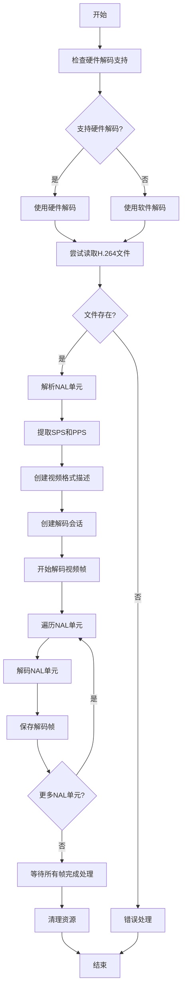

# H.264 硬件解码 demo

H.264 裸流不能直接送进 VideoToolbox — 解码器需要先拿到 SPS/PPS 构造的 format description, 才知道每一帧 NAL 怎么解。这个项目用 Swift + VideoToolbox 把这套流程跑通: 读 `.h264` 文件 → 切 NAL 单元 → 拿 SPS/PPS 建解码会话 → 帧 NAL 依次送进去 → 回调里把 CVPixelBuffer 存成 PNG。卡点主要在 NAL 切分边界和 Annex-B 起始码处理, 跑通的判据是 `decoded_frames/` 里出现按帧序号排列的 PNG 且画面正确。

## 怎么跑

Xcode 编译运行就行, VideoToolbox 是 macOS / iOS 自带的, 没额外依赖。

1. 把 H.264 裸流改名 `video.h264`, 放到 `~/Desktop/forshare/HardwareDecoder/HardwareDecoder/`
2. Xcode 编译运行
3. 解码帧输出到桌面 `decoded_frames/`

默认按 1920x1080 处理, 改分辨率改 `kWidth` / `kHeight` 两个常量。

## 关键设计选择

- **SPS/PPS 单独抽出来初始化**: SPS/PPS 是 sequence/picture parameter set, 装的是解码参数 (分辨率/profile/熵编码方式等), 给解码器配 format description 用。必须先扫流找到 type=7 (SPS) 和 type=8 (PPS) 的 NAL, 用 `CMVideoFormatDescriptionCreateFromH264ParameterSets` 建 format description, 后面帧 NAL 才有解码上下文。
- **硬解失败回落软解**: 不是所有机器 / 所有 profile 都支持硬解, VideoToolbox 创建 session 会直接失败。检测到失败就走软解路径, 保证至少能出一张图, 方便后面定位是 profile 不支持还是 NAL 切错了。
- **回调异步, 主线程不能提前退**: VideoToolbox 解码回调是异步派发, 帧从工作线程往外抛。主线程要等所有帧的 PNG 写完才能退, 不然最后几帧丢盘上。
- **CVPixelBuffer → PNG 走 CIImage**: 解码出来是 YUV 的 CVPixelBuffer, 存盘前用 CIImage + CIContext 转 RGB PNG, 顺手得到一个能直接看的中间产物用来 debug。

## 程序流程

解码会话从 SPS/PPS 拿到帧格式描述, 之后帧 NAL 单元才能依次送进解码器。

## 还能做的

- 现在只处理 1920x1080, SPS 里其实带了分辨率信息, 应该解析出来自动配, 不要写死常量
- B 帧没测过 — 当前 demo 素材只有 I/P 帧, 带 B 帧的流涉及 DTS/PTS 重排, 现在的逐帧顺序送大概率出错
- 输出 PNG 太重 (单帧几 MB), 学习 demo 够用, 想看实时画面应该接 AVSampleBufferDisplayLayer 直接渲染
